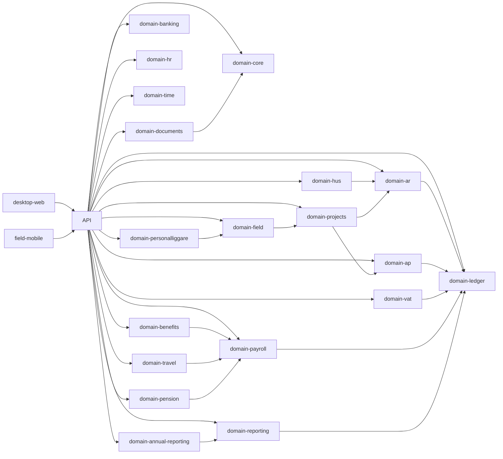

# ADR-0003 — Domain boundaries

Status: Accepted  
Date: 2026-03-21

## Context

Systemet ska hantera bokföring, moms, lön, förmåner, resor, HUS/ROT-RUT, dokument, projekt, bygg, personalliggare och årsredovisning utan att bli en spagettiapp. Vi väljer därför en **modulär monolit först** med hårda domängränser.

## Decision

Vi delar systemet i följande domäner:

- `domain-core`
- `domain-org-auth`
- `domain-documents`
- `domain-ledger`
- `domain-vat`
- `domain-ar`
- `domain-ap`
- `domain-banking`
- `domain-hr`
- `domain-time`
- `domain-payroll`
- `domain-benefits`
- `domain-travel`
- `domain-pension`
- `domain-hus`
- `domain-projects`
- `domain-field`
- `domain-personalliggare`
- `domain-reporting`
- `domain-annual-reporting`
- `domain-integrations`

## Rules

1. Varje domän äger sina tabeller, tjänster, events och tester.
2. Ingen domän får skriva direkt i en annan domäns tabeller.
3. Ledgern är enda källan till bokföring. Alla andra domäner publicerar **posting intents** eller **domain events**.
4. UI får inte innehålla domänregler.
5. Regelpaket ligger i respektive domän eller i gemensam regelmotor, aldrig i controllers.
6. Integrationsadaptrar är egna lager runt domänerna.
7. Alla cross-domain-skrivningar sker via applikationstjänster, outbox eller explicita orchestrators.

## Allowed dependency graph

## Module responsibilities

### domain-ledger
- journaler
- verifikationsserier
- periodlåsning
- balansinvarianten
- drilldown

### domain-vat
- momskoder
- momsbeslutsträd
- deklarationsboxar
- reverse charge
- importmoms
- periodisk sammanställning
- OSS/IOSS

### domain-payroll
- löneperiod
- lönekörning
- lönearter
- skatteunderlag
- arbetsgivaravgifter
- AGI-export/submission

### domain-hus
- HUS-avdrag
- ROT/RUT-klassning
- arbetskostnad
- kundandel
- ansökningsfil
- beslut, avslag, delgodkännande, återkrav

### domain-personalliggare
- byggarbetsplats
- registrering av närvaro
- kiosk/mobile-check-in
- offline sync
- export och kontrollspår

## Verification

- [ ] Varje package har tydlig README och public API.
- [ ] Inga förbjudna imports mellan domäner.
- [ ] Dependency-cruiser eller motsvarande blockerar cirkulära beroenden.
- [ ] Ledger mutationer kan bara ske via ledger application service.
