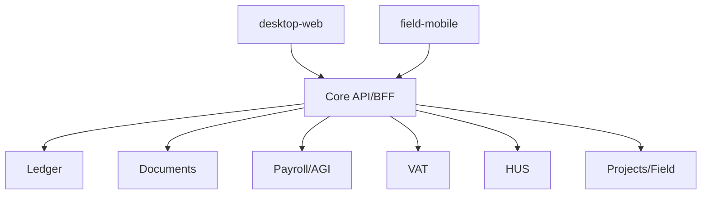

# Enterprise UI plan

Detta dokument beskriver hur produktens UI ska se ut när kärnlogiken är stabil. Det är en separat plan just för att design inte ska styra fel arkitektur tidigt.

## North star

- **desktop-web** ska kännas som ett rymdskepp på desktop.
- **field-mobile** ska vara tumvänlig och superpraktisk ute på jobb.
- Desktop-web ska vara fullständig för alla roller; mobile ska vara förenklad utan att kännas billig.

Desktop-web är den enda kompletta desktop-ytan. Mobil är stödytan för snabba flöden ute på jobb.

## Gemensamma designprinciper

- Desktop first.
- Keyboard first i desktop-web.
- Thumb-friendly i mobile.
- Hög informationsdensitet med progressiv förenkling i desktop-web.
- Hög beslutsklarhet i field-mobile.
- Offline-resiliens i field-mobile.
- Inga irreversibla actions utan tydlig bekräftelse.
- Drilldown överallt där siffror visas.
- Förklaringar ska vara synliga nära siffror, inte gömda långt bort.

## Surface map



## Design tokens

### Typography
- Desktop-web: tight systemfont stack, bra tabelläsbarhet, tydliga siffror och tydlig hierarki mellan dashboard, grid och drilldown
- Field-mobile: stor tapp-yta och tydliga siffror

### Density modes
- compact
- comfortable
- review

### Color semantics
- neutral
- info
- success
- warning
- danger
- locked
- attention required

### State semantics
- draft
- pending
- approved
- booked
- submitted
- accepted
- partially accepted
- rejected
- locked

## Desktop-web — rymdskepp

### Målgrupp
- företagsägare
- administratör
- ekonomiansvarig
- controller
- löneadmin
- redovisningskonsult
- byrå
- power user
- projektledare
- projektcontroller

### Layout

- vänster nav med modulområden
- toppbar med global sök, bolagsväxling, period, varningscenter
- arbetsyta med:
  - huvudtabell eller dashboard
  - höger inspector-panel
  - batch action bar
  - snabbfilter
  - keyboard help overlay

### Modulområden

- Inbox
- AR
- AP
- Bank
- Ledger
- Moms
- Payroll
- Benefits
- Travel
- Pension
- Projects
- Field control
- Personalliggare
- Reporting
- Close
- Annual
- Integrations
- Admin

### Komponenter som måste finnas

- ultra-dense data grid
- column chooser
- saved views
- sticky totals row
- right-side inspector
- split-view compare
- timeline/event rail
- document viewer with side metadata
- inline diff viewer
- bulk edit modal
- exception workbench
- side-by-side posting preview
- rule explanation drawer
- reconciliation matrix
- pivot table light
- formula cards
- smart badges

### Datavisualiseringar

Måste finnas som förstaklasskomponenter:
- stapeldiagram
- linjediagram
- vattenfallsdiagram
- prognosband med confidence
- kassaflödeskurva
- åldersanalys-staplar
- marginaltrender
- beläggningsheatmap
- attestflödesfunnel
- close-progress dashboard
- rule-exception histogram

Alla grafer måste:
- kunna filtreras på period, bolag, projekt, kostnadsställe
- kunna exporteras
- ha drilldown till underlag
- visa exakt definition av måttet

### Viktiga pro-sidor

#### Inbox workbench
- tabell över inkommande dokument
- vänster dokumentlista
- mittpanel med dokumentviewer
- höger panel med tolkning, bokföringsförslag, attest och länkningar

#### AP workbench
- leverantörsfakturor i grid
- status, förfallodatum, atteststatus, avvikelseflaggor
- split view med fakturabild och kontering
- payment proposal batch run

#### Bank reconciliation
- vänster internposter
- höger bankhändelser
- auto-match suggestions
- manual match and split
- exception reasons

#### Ledger explorer
- trial balance
- klicka konto -> verifikationer
- klicka verifikation -> journal lines + document links
- compare periods
- lock-period actions

#### Payroll cockpit
- lönekalender
- körningsstatus
- warnings
- AGI status
- benefit and pension sidebars
- compare runs

#### Close workbench
- checklistor
- blockers
- avstämningskort
- ansvarig per delmoment
- sign-off chain

## Guided patterns inside desktop-web

Detta är inte en separat desktop-yta. Det är ett uppsatt arbetssätt inuti samma desktop-webb för roller som behöver färre steg och tydligare guidning.

### Typiska användare
- företagsägare
- administratör
- mindre bolag
- projektledare med enklare ekonomibehov

### Principer
- en sak i taget när flödet är komplext
- tydliga nästa steg
- färre kolumner i standardvyer för lättare roller
- större whitespace i guidelägen
- färre batchfunktioner i guidelägen
- tydliga statuskort

### Must-have landningssidor och vyer i samma desktop-web
- startsida
- att-göra
- kundfakturor
- leverantörsfakturor
- betalningar
- projektöversikt
- tid/frånvaro
- resor/utlägg
- lön på sammanfattningsnivå
- färdiga rapporter
- dokumentarkiv

### Startsida
- kassaläge
- uppgifter att göra
- sena fakturor
- väntande attester
- lönekalender
- kommande deadlines
- viktiga varningar
- mini-prognos

### UI-regler
- inga överlastade gridar som standard för lättare roller
- wizardar för komplexa flöden
- tydliga callouts för fel
- förklaringar i naturligt språk
- full drilldown till samma underliggande data som övriga desktop-webben

## Field-mobile — tumvänlig mobil

### Primära flikar
- Idag
- Jobb
- Tid
- Resor/Utlägg
- Check-in
- Material
- Signatur
- Profil

### Grundprinciper
- stora tappytor
- enhandsgrepp
- offline först för fältfunktioner
- kamera nära till hands
- minimal textinmatning
- tydlig synkstatus

### Skärmar
- jobbkort
- check-in/out
- snabbtid
- materialuttag
- fotouppladdning
- röstnotering
- kundsignatur
- personalliggare
- körjournal
- navigering till plats

## Komponentbibliotek

### ui-core
- typografi
- färger
- spacing
- ikoner
- feedback states
- modals
- drawers
- toasts
- tabs
- breadcrumbs

### ui-desktop
- dense grid
- filter builder
- batch toolbar
- inspector
- compare view
- analytics cards
- reconciliation matrix
- command palette
- wizard components
- summary cards
- guided tables
- action cards

### ui-mobile
- thumb actions
- offline state badges
- sticky bottom actions
- job cards

## Accessibility

- full keyboard support i desktop-web
- ordentlig focus handling
- ARIA för tabeller, drawers och dialoger
- höga kontraster
- ingen information bara i färg
- mobilanpassade tappytor
- skärmläsarstöd på kritiska sidor

## Performance budget

- desktop-web ska kännas omedelbar även på stora tabeller
- desktop-web ska ladda dashboard och guided startsidor inom få sekunder
- mobile ska fungera i svag uppkoppling
- virtuella listor för stora tabeller
- dokumentviewer ska streama stora filer
- data ska hämtas i lager: summary först, detalj vid drilldown

## Interaction patterns

### Drilldown
Siffra → transaktioner → underlag → audit trail

### Explainability
Klick på badge eller varning öppnar:
- varför
- vilket regelpaket
- vilka indata
- vilka nästa steg

### Compare mode
Jämför perioder, versioner, lönekörningar, momsrapporter, HUS-beslut eller budget/utfall sida vid sida.

## Dashboards som måste finnas

### CFO dashboard
- intäkt
- kostnad
- EBITDA-light
- cash
- DSO
- DPO
- förfallna poster
- prognosband
- största avvikelser

### Payroll dashboard
- kommande körningar
- blockerande fel
- AGI-status
- pension status
- benefit exceptions

### Project dashboard
- budget vs utfall
- marginal
- WIP
- beläggning
- sena arbetsorder
- materialavvikelser

### Close dashboard
- checklist progress
- blockers by owner
- avstämningar klara/ej klara
- rapportdiffar

## Design review gates

- [ ] Desktop-web kombinerar tät enterprise-informationsdensitet med guidade flöden utan att splittras i flera desktop-ytor.
- [ ] Desktop-web kan användas med tangentbord.
- [ ] Mobile kan användas med en hand för kärnflöden.
- [ ] Alla grafer har drilldown.
- [ ] Alla kritiska sidor har loading, empty, error och locked states.
- [ ] Rule explanation finns där beslut visas.

## Codex-prompt

```text
Read docs/ui/ENTERPRISE_UI_PLAN.md and docs/adr/ADR-0002-surface-strategy.md.

Implement only the UI layer for the selected surface:
- use ui-core as the shared base
- use one complete desktop-web for all roles, with role-adapted dashboards and guided flows inside the same surface
- keep mobile thumb-friendly and workflow-driven
- wire real states: loading, empty, error, locked, warning, success
- add charts and drilldown affordances
- do not move domain logic into UI

Return screenshots or storybook stories for all new states.
```
